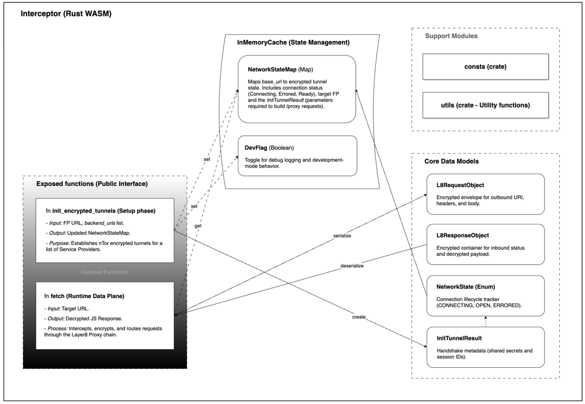
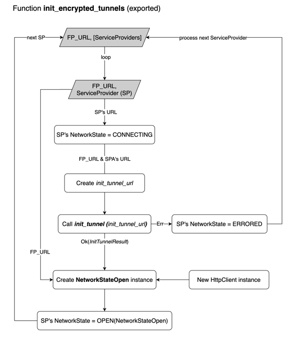

# Layer8 Interceptor

*Table of contents:*

- [1. Overview](#1-overview)
- [2. Project Structure](#2-project-structure)
- [3. Init Tunnel](#3-init_encrypted_tunnels-setup-phase)
- [4. Fetch](#4-fetch-runtime-phase)
- [5. InMemoryCache](#5-inmemorycache-state-management)
- [6. Core Data Models](#6-core-data-models)

<div style="page-break-after: always;"></div>

## 1. Overview

The Interceptor is a Rust-compiled WebAssembly (WASM) module that runs inside the browser and sits between a JavaScript
client and a set of backend service providers. It loads via the WASM–JS bridge with no extension or plugin required,
transparently replacing the native `fetch` call with an encrypted, proxied equivalent routed through the Layer8 Proxy
chain.
All tunnel state lives in browser memory for the duration of the page session.

Usage follows two sequential phases: first, `init_encrypted_tunnels` is called once at startup to establish
nTor-encrypted tunnels with the backend service providers; then, `fetch` is called at runtime to intercept, encrypt, and
proxy individual requests through those tunnels.

The module is organized into four logical areas as shown in the figure below:

</br>
*Figure 1: Interceptor module high-level architecture*

**Exposed APIs/Functions** — the public interface called by JavaScript consumers</br>
**InMemoryCache** — in-process state management</br>
**Core Data Models** — typed structs and enums shared across the module</br>
**Support Modules** — utility crates used internally</br>
</br>

<div style="page-break-after: always;"></div>

## 2. Project Structure

This section provides an overview of the repository layout and the responsibilities of each module.

```
layer8-interceptor
├── src
│   ├── types/                      - Core data models and type definitions
│   │   ├── request/
│   │   │   ├── mod.rs               - Defines `L8RequestObject` struct to wrap and manage request data
│   │   │   ├── body.rs              - Defines `L8RequestBody` struct with methods to handle and transform request body
│   │   │   └── mode_and_policies.rs - Defines `L8RequestMode` enum and request policies related functions
│   │   ├── response.rs              - Defines `L8ResponseObject` struct for HTTP response handling
│   │   ├── http_caller.rs           - Defines HTTP caller types for executing real HTTP calls or mocking them
│   │   ├── network_state.rs         - Defines `NetworkState`, `NetworkStateResponse` enums and `NetworkStateOpen` struct for tunnel state management
│   │   ├── service_provider.rs      - Defines `ServiceProvider` struct for managing service provider configuration
│   │   └── mod.rs                   - Module exports for types
│   ├── utils/                       - Utility functions and helpers
│   │   ├── mod.rs                   - Exports utility modules
│   │   ├── headers.rs               - Header manipulation utilities
│   │   ├── body.rs                  - Body parsing and handling utilities
│   │   └── print.rs                 - Debugging and print utilities
│   ├── constants.rs                 - Global constants and configuration values used throughout the project
│   ├── storage.rs                   - In-memory state management via `InMemoryCache` public struct
│   ├── fetch.rs                     - Exported `fetch()` public API for intercepting HTTP requests
│   ├── init_tunnel.rs               - Exported `init_encrypted_tunnel()` public API for tunnel initialization
│   └── lib.rs                       - Library root, WASM module exports
├── tests/
│   └── all_tests.rs                 - Integration and benchmark tests
├── pkg/                             - WASM compiled artifacts and JavaScript bindings
│   ├── l8_intercept.js              - Generated WASM JavaScript wrapper
│   ├── l8_intercept_bg.wasm         - Compiled WebAssembly binary
│   ├── l8_intercept.d.ts            - TypeScript type definitions for WASM exports
│   └── package.json                 - NPM package configuration
├── Cargo.toml                       - Rust project manifest and dependencies
├── Makefile                         - Build automation scripts
└── README.md                        - Project overview and documentation
```

<div style="page-break-after: always;"></div>

## 3. `init_encrypted_tunnels` (Setup Phase)

Initializes encrypted tunnels for the given service providers (SPs). Spawns background tasks that perform the 
`init-tunnel` HTTP handshake with the forward proxy, complete the NTor key exchange, and update the global network state
for each provider.

**Call this once** at application startup before making any `fetch` calls.

#### Function Signature

```rust
pub fn init_encrypted_tunnels(
    forward_proxy_url: String,
    service_providers: Vec<ServiceProvider>,
    dev_flag: Option<bool>,
) -> Result<(), JsValue> {}
```

#### Parameters

| Parameter           | Type                   | Description                                                |
|---------------------|------------------------|------------------------------------------------------------|
| `forward_proxy_url` | `String`               | URL of the forward proxy (e.g. `https://fp.example.com`)   |
| `service_providers` | `Vec<ServiceProvider>` | List of service provider entries to initialize tunnels for |
| `dev_flag`          | `Option<bool>`         | Optional flag to enable verbose/dev logging                |

#### Returns

| Result         | Description                                   |
|----------------|-----------------------------------------------|
| `Ok(())`       | Background tasks were scheduled successfully  |
| `Err(JsValue)` | Building the backend URL failed synchronously |

#### Flow

For each service provider in the list, the function executes the following steps:

1. Sets the SP's `NetworkState` to `CONNECTING`.
2. Constructs the `init_tunnel_url` from `FP_URL` and the SP's URL.
3. Calls the sub-function `init_tunnel(init_tunnel_url)`.

- On **error** → sets the SP's `NetworkState` to `ERRORED` and moves to the next SP.
- On **success** → receives `Ok(InitTunnelResult)`.

4. Creates a new `HttpClient` instance and a `NetworkStateOpen` instance (combining the `InitTunnelResult`, the HTTP
   client, and `FP_URL`).
5. Sets the SP's `NetworkState` to `OPEN(NetworkStateOpen)`.
6. Repeats for the next service provider.

</br>
*Figure 2: `init_encrypted_tunnels` flow diagram*


#### Sub-function: `init_tunnel`

```rust
pub async fn init_tunnel(
    backend_url: String,
    http_caller: impl HttpCaller,
) -> Result<InitTunnelResult, JsValue> {}
```

Performs the actual NTor handshake with the forward proxy for a single service provider. Called internally by
`init_encrypted_tunnels` for each SP. Returns an `InitTunnelResult` containing the shared secrets and session IDs
required for subsequent encrypted `fetch` calls.

##### Parameters

| Parameter     | Type              | Description                                                                                                                                                                                                            |
|---------------|-------------------|------------------------------------------------------------------------------------------------------------------------------------------------------------------------------------------------------------------------|
| `backend_url` | `String`          | The `init-tunnel` endpoint on the forward proxy. The forward proxy expects a `backend_url` query parameter pointing to the backend (e.g. `https://fp.example.com/init-tunnel?backend_url=https://backend.example.com`) |
| `http_caller` | `impl HttpCaller` | An implementation of the `HttpCaller` trait used to send the HTTP request (`ActualHttpCaller` in production, or a mock in tests)                                                                                       |

##### Returns

| Result                 | Description                                                                                                |
|------------------------|------------------------------------------------------------------------------------------------------------|
| `Ok(InitTunnelResult)` | NTor handshake succeeded; result contains the established `NTorClient` and JWTs                            |
| `Err(JsValue)`         | Request failed after all retries, response could not be read or deserialized, or the NTor handshake failed |

##### Flow

1. Generates the NTor client initialisation message and sends it as JSON `{ "public_key": ... }`.
2. Retries the request up to `INIT_TUNNEL_RETRY_ATTEMPTS` with `INIT_TUNNEL_RETRY_SLEEP_DELAY` between attempts on
   failure.
3. Deserializes the response into `InitTunnelResponse` and completes the NTor handshake.
4. On success, returns an `InitTunnelResult` with the established `NTorClient` and JWTs.


</br>
*Figure 3: `init_tunnel` flow diagram*

##### Notes

When dev logging is enabled (`InMemoryCache::get_dev_flag()`), errors and the NTor shared secret are logged to the web
console for debugging.

<div style="page-break-after: always;"></div>

## 4. `fetch` (Runtime Phase)

Performs an HTTP request compatible with the Web Fetch API, intercepts, encrypts and proxies the request through the Layer8 chain. 
This async function returns `Result<Response, JsValue>` and is used during runtime after tunnels are established 
with `init_encrypted_tunnels`.

#### Function Signature

```rust
pub async fn fetch(
    resource: JsValue,
    options: Option<RequestInit>,
) -> Result<web_sys::Response, JsValue> {}
```

#### Parameters
- `resource: JsValue` — string, `Url` or `Request` specifying the request target.
- `options: Option<RequestInit>` — optional fetch init (method, headers, body, etc.).

#### Returns
- `Ok(web_sys::Response)` on successful provider response.
- `Err(JsValue)` on network/proxy errors or failed tunnel initialization.

#### Behavior
- Reads current `NetworkState` (forward proxy URL and `InitTunnelResult`) from `InMemoryCache`.
- Resolves the target and backend base URLs via `utils`.
- Constructs an `L8RequestObject` (backend URL, original `resource`, `options`) and sends it using `NetworkStateOpen`.
- On send/network errors attempts to reinitialize the tunnel and retry the request.

#### Retry and reinitialization
- Tries up to `constants::FETCH_RETRY_ATTEMPTS` re-initializations.
- On send errors calls `init_tunnel` at `{forward_proxy_url}/init-tunnel?backend_url={backend_base_url}` and updates `InMemoryCache`.
- If attempts are exhausted or the proxy returns an explicit error, returns `Err(JsValue)`.

#### Logging
- When dev logging is enabled (`InMemoryCache::get_dev_flag()`), logs extra messages to the browser console (`web_sys::console`) during reinitialization and on errors.

#### Notes
- Assumes `init_encrypted_tunnels` was called at startup, but will perform local reinitialization on failures if needed.
- Returns a standard `web_sys::Response` for compatibility with consumer code.

#### Sub-function: L8RequestObject.send()

[to be continue]

<div style="page-break-after: always;"></div>

## 5. `InMemoryCache` (State Management)

`InMemoryCache` is an associated struct that maintains network connection state during runtime. This state is not 
persisted across page loads. The struct is a zero-field wrapper—no data is stored directly within it; instead, all 
state is managed through two thread-local variables:

- `NETWORK_STATE_MAP` — global cache mapping provider URL to `NetworkState`,
- `DEV_FLAG` — development mode flag for extra logging.

All methods are associated functions operating on those thread-local variables. They set states to `CONNECTING`, `OPEN` 
or `ERRORED`, retrieve an open state asynchronously (with retries), and manage the `DEV_FLAG`.

<div style="page-break-after: always;"></div>

## 6. Core Data Models

### 6.1. Constants
<br>

**Description:**  
Configuration constants controlling retry behavior for network operations.

| Constant                        | Type  | Value  | Description                                                                    |
|---------------------------------|-------|--------|--------------------------------------------------------------------------------|
| `FETCH_RETRY_SLEEP_DELAY`       | `i32` | `50`   | Delay (milliseconds) between fetch retry attempts.                             |
| `INIT_TUNNEL_RETRY_SLEEP_DELAY` | `i32` | `1000` | Delay (milliseconds) between tunnel initialization retries.                    |
| `FETCH_RETRY_ATTEMPTS`          | `u32` | `3`    | Maximum number of attempts to reinitialize the tunnel during fetch operations. |
| `INIT_TUNNEL_RETRY_ATTEMPTS`    | `u32` | `3`    | Maximum number of attempts to send the `init_tunnel` request.                  |

---
<br>

### 6.2. `HttpCaller` (Trait)
<br>

**Description:**  
Abstracts the HTTP transport layer. Implemented by ActualHttpCaller in production and substituted with a mock in tests.
Passed into `init_tunnel` to allow the handshake to be tested without a live network.

<br>

### 6.3. `ServiceProvider` (Struct)
<br>

**Description:**  
Represents a service provider capable of handling resource requests via a proxy or tunnel.

| Field      | Type                     | Description                                                                                      |
|------------|--------------------------|--------------------------------------------------------------------------------------------------|
| `url`      | `String`                 | Base URL of the service provider.                                                                |
| `_options` | `Option<js_sys::Object>` | Optional configuration parameters passed from JavaScript. Currently treated as a generic object. |
---
<br>

**Attributes:**

- `#[derive(Clone)]`: Allows duplication of the provider instance.
- `#[wasm_bindgen(getter_with_clone)]`: Enables safe access to fields from JavaScript by cloning values.

<br>

### 6.4. `NetworkState` (Enum)

**Description:**  
Represents the lifecycle state of the network connection for a `ServiceProvider`.

| Variant      | Type               | Description                                                                                                 |
|--------------|--------------------|-------------------------------------------------------------------------------------------------------------|
| `CONNECTING` | —                  | The network connection is currently being established.                                                      |
| `OPEN`       | `NetworkStateOpen` | The connection is successfully established and ready for use.                                               |
| `ERRORED`    | `JsValue`          | An error occurred during connection establishment, typically originating from JavaScript/WASM interactions. |

---
<br>

### 6.5. `NetworkStateOpen` (Struct)

**Description:**  
Represents the operational state of the network once the key exchange has completed and the connection is ready for use.

| Field                | Type               | Description                                                                                     |
|----------------------|--------------------|-------------------------------------------------------------------------------------------------|
| `http_client`        | `reqwest::Client`  | HTTP client used to send network requests through the established tunnel.                       |
| `init_tunnel_result` | `InitTunnelResult` | Result of the tunnel initialization process, containing cryptographic and session-related data. |
| `forward_proxy_url`  | `String`           | URL of the forward proxy through which requests are routed.                                     |

---
<br>

### 6.6. `NetworkStateResponse` (Enum)

**Description:**  
Represents possible outcomes when interacting with the network state or proxy server.

| Variant            | Type                | Description                                                                                   |
|--------------------|---------------------|-----------------------------------------------------------------------------------------------|
| `ProxyError`       | `JsValue`           | Indicates an unexpected or malformed response from the proxy server.                          |
| `ProviderResponse` | `web_sys::Response` | Successful HTTP response returned from the proxy server.                                      |
| `Reinitialize`     | —                   | Signals that the network connection should be reinitialized (e.g., tunnel expired or failed). |

---
<br>

### 6.7. `InitTunnelResponse` (Struct)

**Description:**  
Represents the server’s response when initializing a secure tunnel, including cryptographic materials and authentication
tokens.

| Field                  | Type      | JSON Name              | Description                                                     |
|------------------------|-----------|------------------------|-----------------------------------------------------------------|
| `ephemeral_public_key` | `Vec<u8>` | `ephemeral_public_key` | Ephemeral public key used for key exchange.                     |
| `t_b_hash`             | `Vec<u8>` | `t_b_hash`             | Hash value used for tunnel binding or verification.             |
| `int_rp_jwt`           | `String`  | `jwt1`                 | JWT token for the relying party.                                |
| `int_fp_jwt`           | `String`  | `jwt2`                 | JWT token for the forward proxy.                                |
| `server_id`            | `String`  | `server_id`            | Unique identifier of the server establishing the tunnel.        |
| `static_public_key`    | `Vec<u8>` | `public_key`           | Server’s static public key for long-term identity verification. |

---
<br>

### 6.8. `InitTunnelResult` (Struct)

**Description:**
Represents the internal result of tunnel initialization, containing the NTor client state and session JWTs.

| Field        | Type         | Description                                                                |
|--------------|--------------|----------------------------------------------------------------------------|
| `client`     | `NTorClient` | NTor client holding key-exchange state and derived cryptographic material. |
| `int_rp_jwt` | `String`     | JWT for the relying party used in subsequent requests.                     |
| `int_fp_jwt` | `String`     | JWT for the forward proxy used for routing requests.                       |

---
<br>

### 6.9. `L8RequestObject` (Struct)

**Description:**  
A JSON-serializable wrapper for HTTP requests compatible with the browser Fetch API.
<br>

#### 6.9.1 Core Request Fields

| Field     | Type                                 | Description                                         |
|-----------|--------------------------------------|-----------------------------------------------------|
| `uri`     | `String`                             | Target URI for the HTTP request.                    |
| `method`  | `String`                             | HTTP method (e.g., `GET`, `POST`, `PUT`, `DELETE`). |
| `headers` | `HashMap<String, serde_json::Value>` | HTTP headers represented as key-value pairs.        |
| `body`    | `Vec<u8>`                            | Raw request body in bytes.                          |
---
<br>

#### 6.9.2 User-Agent / Fetch Configuration (Not Serialized)

These fields are marked with `#[serde(skip)]` and are intended for internal usage but current unused to mirror Fetch API
behavior.

| Field                   | Type                    | Description                                                           |
|-------------------------|-------------------------|-----------------------------------------------------------------------|
| `body_used`             | `bool`                  | Indicates whether the request body has already been consumed.         |
| `cache`                 | `String`                | Cache mode (e.g., `"default"`, `"no-cache"`).                         |
| `credentials`           | `String`                | Credential mode (e.g., `"include"`, `"same-origin"`).                 |
| `destination`           | `String`                | Request destination type (e.g., `"document"`, `"script"`).            |
| `integrity`             | `String`                | Subresource integrity metadata.                                       |
| `is_history_navigation` | `bool`                  | Indicates if the request is triggered by browser history navigation.  |
| `keep_alive`            | `Option<bool>`          | Whether the request should outlive the page lifecycle.                |
| `mode`                  | `Option<L8RequestMode>` | Fetch mode (e.g., `cors`, `no-cors`, `same-origin`).                  |
| `redirect`              | `Option<String>`        | Redirect handling behavior (e.g., `"follow"`, `"error"`, `"manual"`). |
| `signal`                | `Option<AbortSignal>`   | Allows the request to be aborted.                                     |

---
<br>

### 6.10. `L8ResponseObject` (Struct)

**Description:**  
A JSON-serializable representation of an HTTP response received from the proxy, adapted for WASM compatibility.

| Field         | Type                                 | Description                                                                        |
|---------------|--------------------------------------|------------------------------------------------------------------------------------|
| `status`      | `u16`                                | HTTP status code (e.g., `200`, `404`).                                             |
| `status_text` | `String`                             | Human-readable description of the status code (e.g., `"OK"`).                      |
| `headers`     | `HashMap<String, serde_json::Value>` | Collection of HTTP headers represented as key-value pairs.                         |
| `body`        | `Vec<u8>`                            | Raw response body in bytes.                                                        |
| `ok`          | `bool`                               | Indicates whether the response status is successful (`2xx`). Present but not used. |
| `url`         | `String`                             | Final URL of the response after redirects. Present but not used.                   |
| `redirected`  | `bool`                               | Indicates whether the request was redirected. Present but not used.                |
---

