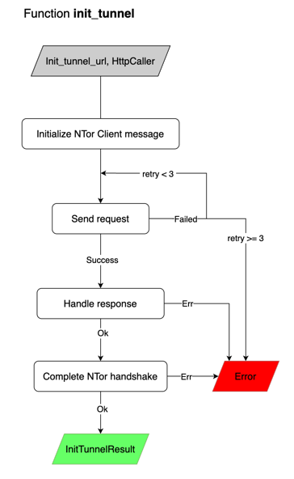

# Layer8 Interceptor

**Implementation Language:** Rust (compiled to WebAssembly)  
**Compiler Toolchain:** wasm-pack
**Runtime Environment:** Browser (via WASM–JS bridge)

*Table of contents:*

- [1. Overview](#1-overview)
- [2. Project Structure](#2-project-structure)
- [3. Deployment](#3-deployment)
- [4. Configuration](#4-configuration)
- [5. Exported APIs and Main Functions](#5-exported-apis-and-main-functions)
    - [5.1. Exported API: `init_encrypted_tunnels`](#51-exported-api-init_encrypted_tunnels-setup-phase)
        - [5.1.1. Description](#511-description)
        - [5.1.2. Function Signature](#512-function-signature)
        - [5.1.3. Parameters](#513-parameters)
        - [5.1.4. Returns](#514-returns)
        - [5.1.5. Errors](#515-errors)
        - [5.1.6. Side Effects](#516-side-effects)
        - [5.1.7. Flow](#517-flow)
    - [5.2. Sub-function: `init_tunnel`](#52-sub-function-init_tunnel)
        - [5.2.1. Description](#521-description)
        - [5.2.2. Function Signature](#522-function-signature)
        - [5.2.3. Parameters](#523-parameters)
        - [5.2.4. Returns](#524-returns)
        - [5.2.5. Errors](#525-errors)
        - [5.2.6. Side Effects](#526-side-effects)
        - [5.2.7. Flow](#527-flow)
    - [5.3. Exported API: `fetch`](#53-exported-api-fetch-runtime-phase)
        - [5.3.1. Description](#531-description)
        - [5.3.2. Function Signature](#532-function-signature)
        - [5.3.3. Parameters](#533-parameters)
        - [5.3.4. Returns](#534-returns)
        - [5.3.5. Errors](#535-errors)
        - [5.3.6. Side Effects](#536-side-effects)
        - [5.3.7. Flow](#537-flow)
    - [5.4. Sub-function: `L8RequestObject.l8_send`](#54-sub-function-l8requestobjectl8_send)
        - [5.4.1. Description](#541-description)
        - [5.4.2. Function Signature](#542-function-signature)
        - [5.4.3. Parameters](#543-parameters)
        - [5.4.4. Returns](#544-returns)
        - [5.4.5. Errors](#545-errors)
        - [5.4.6. Side Effects](#546-side-effects)
        - [5.4.7. Flow](#547-flow)
    - [5.5. Sub-function: `handle_response`](#55-sub-function-handle_response)
        - [5.5.1. Description](#551-description)
        - [5.5.2. Function Signature](#552-function-signature)
        - [5.5.3. Parameters](#553-parameters)
        - [5.5.4. Returns](#554-returns)
        - [5.5.5. Errors](#555-errors)
        - [5.5.6. Side Effects](#556-side-effects)
        - [5.5.7. Flow](#557-flow)
- [6. InMemoryCache](#6-inmemorycache-state-management)
    - [6.1. `get_network_state`](#61-get_network_state)
    - [6.2. `set_connecting_network_state`](#62-set_connecting_network_state)
    - [6.3. `set_open_network_state`](#63-set_open_network_state)
    - [6.4. `set_errored_network_state`](#64-set_errored_network_state)
    - [6.5. `get_dev_flag`](#65-get_dev_flag)
    - [6.6. `set_dev_flag`](#66-set_dev_flag)
- [7. Core Data Models](#7-core-data-models)
    - [7.1. Constants](#71-constants)
    - [7.2. Trait `HttpCaller`](#72-trait-httpcaller)
    - [7.3. Struct `ServiceProvider`](#73-struct-serviceprovider)
    - [7.4. Enum `NetworkState`](#74-enum-networkstate)
    - [7.5. Struct `NetworkStateOpen`](#75-struct-networkstateopen)
    - [7.6. Enum `NetworkStateResponse`](#76-enum-networkstateresponse)
    - [7.7. Struct `InitTunnelResponse`](#77-struct-inittunnelresponse)
    - [7.8. Struct `InitTunnelResult`](#78-struct-inittunnelresult)
    - [7.9. Struct `L8RequestObject`](#79-struct-l8requestobject)
    - [7.10. Struct `L8ResponseObject`](#710-struct-l8responseobject)

<div style="page-break-after: always;"></div>

## 1. Overview

The Interceptor is a Rust-compiled WebAssembly (WASM) module that runs inside the browser and sits between a JavaScript
client and a set of backend service providers. It loads via the WASM–JS bridge with no extension or plugin required,
transparently replacing the native `fetch` call with an encrypted, proxied equivalent routed through the Layer8 Proxy
chain.
All tunnel state lives in browser memory for the duration of the page session.

Usage follows two sequential phases: first, `init_encrypted_tunnels` is called once at startup to establish
nTor-encrypted tunnels with the backend service providers; then, `fetch` is called at runtime to intercept, encrypt, and
proxy individual requests through those tunnels.

The module is organized into four logical areas as shown in the figure below:

</br>
*Figure 1: Interceptor module high-level architecture*

**Exposed APIs/Functions** — the public interface called by JavaScript consumers</br>
**InMemoryCache** — in-process state management</br>
**Core Data Models** — typed structs and enums shared across the module</br>
**Support Modules** — utility crates used internally</br>
</br>
<div style="page-break-after: always;"></div>

## 2. Project Structure

This section provides an overview of the repository layout and the responsibilities of each module.

<div style="font-size: 0.5em;">

```text
layer8-interceptor
├── src
│   ├── types/                      - Core data models and type definitions
│   │   ├── request/
│   │   │   ├── mod.rs               - Defines `L8RequestObject` struct to wrap and manage request data
│   │   │   ├── body.rs              - Defines `L8RequestBody` struct with methods to handle and transform request body
│   │   │   └── mode_and_policies.rs - Defines `L8RequestMode` enum and request policies related functions
│   │   ├── response.rs              - Defines `L8ResponseObject` struct for HTTP response handling
│   │   ├── http_caller.rs           - Defines HTTP caller types for executing real HTTP calls or mocking them
│   │   ├── network_state.rs         - Defines `NetworkState`, `NetworkStateResponse` enums and `NetworkStateOpen` struct for tunnel state management
│   │   ├── service_provider.rs      - Defines `ServiceProvider` struct for managing service provider configuration
│   │   └── mod.rs                   - Module exports for types
│   ├── utils/                       - Utility functions and helpers
│   │   ├── mod.rs                   - Exports utility modules
│   │   ├── headers.rs               - Header manipulation utilities
│   │   ├── body.rs                  - Body parsing and handling utilities
│   │   └── print.rs                 - Debugging and print utilities
│   ├── constants.rs                 - Global constants and configuration values used throughout the project
│   ├── storage.rs                   - In-memory state management via `InMemoryCache` public struct
│   ├── fetch.rs                     - Exported `fetch()` public API for intercepting HTTP requests
│   ├── init_tunnel.rs               - Exported `init_encrypted_tunnel()` public API for tunnel initialization
│   └── lib.rs                       - Library root, WASM module exports
├── tests/
│   └── all_tests.rs                 - Integration and benchmark tests
├── pkg/                             - WASM compiled artifacts and JavaScript bindings
│   ├── l8_intercept.js              - Generated WASM JavaScript wrapper
│   ├── l8_intercept_bg.wasm         - Compiled WebAssembly binary
│   ├── l8_intercept.d.ts            - TypeScript type definitions for WASM exports
│   └── package.json                 - NPM package configuration
├── Cargo.toml                       - Rust project manifest and dependencies
├── Makefile                         - Build automation scripts
└── README.md                        - Project overview and documentation
```
</div>

## 3. Deployment

The Interceptor is compiled to WebAssembly (WASM) using `wasm-pack` and is intended to be loaded in a browser
environment. The resulting WASM module and its JavaScript bindings are located in the `pkg/` directory after
compilation. To use the Interceptor in a web application, you would typically include the generated JavaScript wrapper
(`l8_intercept.js`) in your HTML and call the exposed APIs (`init_encrypted_tunnels` and `fetch`) from your JavaScript
code to initialize tunnels and intercept HTTP requests. The Interceptor does not require any special hosting or server
configuration, as it runs entirely in the client's browser. However, the backend service providers that it connects to
must be properly configured to handle the NTor handshake and proxy requests from the Interceptor.
</br>

</br>
*Figure 2: Deployment diagram showing the Interceptor running in the browser*

<br>

## 4. Configuration

The Interceptor module is designed to be configured at runtime via the `init_encrypted_tunnels` API, which accepts a
list of `ServiceProvider` objects. Each `ServiceProvider` contains a `url` field that specifies the base URL of a
backend service provider that the Interceptor should establish a tunnel with. The `init_encrypted_tunnels` function uses
these URLs to perform the NTor handshake and set up encrypted tunnels for each provider. The `ServiceProvider` struct
also includes an `_options` field, which is currently an optional generic object that can be used for future
extensibility, allowing additional configuration parameters to be passed from JavaScript as needed.

Example initialization in JavaScript:
<div style="font-size: 0.5em;">

```javascript
import {initEncryptedTunnel, ServiceProvider} from "l8-intercept";

let forward_proxy_url = import.meta.env.VITE_FORWARD_PROXY_URL || 'http://localhost:6191';
let backend_url = import.meta.env.VITE_BACKEND_URL || 'http://localhost:3000';

try {
    let providers = [ServiceProvider.new(backend_url)];
    initEncryptedTunnel(forward_proxy_url, providers, true);
} catch (err) {
    throw new Error(`Failed to initialize encrypted tunnel: ${err}`);
}
```
</div>

Subsequent calls to the `fetch` API will automatically route requests to URLs matching the configured service providers
through the established tunnels. The Interceptor does not require any additional configuration for the `fetch` API, as
it dynamically retrieves the appropriate tunnel state from the in-memory cache based on the request URL at runtime.

<br>

## 5. Exported APIs and Main Functions

### 5.1. Exported API `init_encrypted_tunnels` (Setup Phase)

#### 5.1.1. Description

Initializes encrypted tunnels for the given service providers (SPs). Spawns background tasks that perform the
`init-tunnel` HTTP handshake with the forward proxy, complete the NTor key exchange, and update the global network state
for each provider.

**Call this once** at application startup before making any `fetch` calls.

#### 5.1.2. Function Signature
<div style="font-size: 0.75em;">

```rust
pub fn init_encrypted_tunnels(
    forward_proxy_url: String,
    service_providers: Vec<ServiceProvider>,
    dev_flag: Option<bool>,
) -> Result<(), JsValue> {}
```
</div>

#### 5.1.3. Parameters

- `forward_proxy_url: String` – Base URL of the forward-proxy (e.g. `https://fp.example.com`). Used to construct the
  `init-tunnel` endpoint and stored in the resulting `NetworkStateOpen` for later request routing.

- `service_providers: Vec<ServiceProvider>` – List of service providers for which tunnels should be established. Each
  entry's `.url` field is used to derive the base URL that serves as a key in the global network state cache.

- `dev_flag: Option<bool>` – When `Some(true)`, enables verbose console logging of tunnel initialization events. `None`
  or `Some(false)` suppresses dev logs.

#### 5.1.4. Returns

- `Ok(())` – All background tasks were scheduled successfully. The tunnels may still be in progress; callers should
  observe the network state to detect when each provider transitions from `connecting` to `open`.

#### 5.1.5. Errors

- `Err(JsValue)` – Returned synchronously if [`utils::get_base_url`] fails to parse the URL of any service provider. In
  this case no background task is spawned for that provider and the function returns immediately without processing the
  remaining providers.

#### 5.1.6. Side Effects

- Calls [`InMemoryCache::set_dev_flag`] to persist the `dev_flag` value globally for the lifetime of the WASM module.
- Calls [`InMemoryCache::set_connecting_network_state`] for each provider, marking its state as `connecting` before the
  background task starts.
- Each spawned task may call one of:
    - [`InMemoryCache::set_open_network_state`] – on successful handshake, stores a [`NetworkStateOpen`] with a new
      `reqwest::Client`, the completed [`InitTunnelResult`], and the forward-proxy URL.
    - [`InMemoryCache::set_errored_network_state`] – on failure, stores the `JsValue` error returned by [`init_tunnel`].

#### 5.1.7. Flow

1. Persist the `dev_flag` in the global cache via `InMemoryCache::set_dev_flag`.
2. For each `ServiceProvider` in `service_providers`:
   a. Extract the base URL with `utils::get_base_url`; return `Err` immediately on failure.
   b. Build the endpoint: `{forward_proxy_url}/init-tunnel?backend_url={base_url}`.
   c. Mark the provider as `connecting` in the global network state cache.
   d. Spawn a local async task (`wasm_bindgen_futures::spawn_local`) that:
    - Calls `init_tunnel(backend_url, ActualHttpCaller).await`.
    - On `Ok(val)`: optionally logs success, constructs a `NetworkStateOpen`, and
      stores it via `InMemoryCache::set_open_network_state`.
    - On `Err(err)`: stores the error via `InMemoryCache::set_errored_network_state`.
3. Return `Ok(())` after all tasks have been scheduled.

</br>
*Figure 3: `init_encrypted_tunnels` flow diagram*

<br>

### 5.2. Sub-function: `init_tunnel`

#### 5.2.1. Description

Establishes an encrypted tunnel with the forward-proxy by performing an NTor key exchange. Sends the client's ephemeral
public key to the forward-proxy's `init-tunnel` endpoint, processes the server's response to complete the handshake, and
returns a result containing the negotiated [`NTorClient`] (holding the shared secret) and the session JWT tokens issued
by both the reverse-proxy and the forward-proxy.

#### 5.2.2. Function Signature
<div style="font-size: 0.75em;">

```rust
pub async fn init_tunnel(
    backend_url: String,
    http_caller: impl HttpCaller,
) -> Result<InitTunnelResult, JsValue> {}
```
</div>

Performs the actual NTor handshake with the forward proxy for a single service provider. Called internally by
`init_encrypted_tunnels` for each SP. Returns an `InitTunnelResult` containing the shared secrets and session IDs
required for subsequent encrypted `fetch` calls.

#### 5.2.3. Parameters

- `request_url: String` – The fully-qualified `init-tunnel` endpoint URL on the forward-proxy, typically including a
  `backend_url` query parameter that points to the target backend service
  (e.g. `https://fp.example.com/init-tunnel?backend_url=https://backend.example.com`).
- `http_caller: impl HttpCaller` – An implementation of the [`HttpCaller`] trait used to dispatch the HTTP request.
  Pass [`ActualHttpCaller`] in production or a mock implementation in tests.

#### 5.2.4. Returns

`Result<InitTunnelResult, JsValue>`

- `Ok(InitTunnelResult)` – The NTor handshake succeeded. The returned value contains:
    - `ntor_client` – the [`NTorClient`] with the established shared secret.
    - `int_rp_jwt` – the session JWT issued by the reverse-proxy.
    - `int_fp_jwt` – the session JWT issued by the forward-proxy.

#### 5.2.5. Errors

Returns `Err(JsValue)` in the following situations:

- The HTTP request fails on every retry attempt (after `INIT_TUNNEL_RETRY_ATTEMPTS` tries).
- The response body cannot be read from the [`HttpCallerResponse`].
- The response body cannot be deserialized into [`InitTunnelResponse`] (panics via `expect_throw`, which surfaces as a
  JavaScript exception).
- The NTor handshake fails (i.e. [`InitTunnelResponse::compute_ntor_handshake`] returns `false`), indicating an
  authentication or key-derivation failure.

#### 5.2.6. Side Effects

- Reads the global dev flag via [`InMemoryCache::get_dev_flag`] to determine whether verbose logging is active.
- When dev logging is enabled, error messages from failed request attempts and the NTor shared secret after a successful
  handshake are written to the browser console via `web_sys::console`.
- Calls [`utils::sleep`] between retry attempts to introduce a delay of `INIT_TUNNEL_RETRY_SLEEP_DELAY` milliseconds,
  temporarily suspending the async task.
- Always logs to `console::error_1` when all retry attempts are exhausted, regardless of the dev flag.

#### 5.2.7. Flow

1. Read the global dev flag from [`InMemoryCache::get_dev_flag`] for verbose logging.
2. Create a new [`InitTunnelResult`] and generate the NTor client's ephemeral public key via [
   `InitTunnelResult::generate_ntor_client_public_key`].
3. Serialize the public key as JSON: `{ "public_key": <bytes> }`.
4. Enter a retry loop (up to `INIT_TUNNEL_RETRY_ATTEMPTS` attempts):
   a. Build a `POST` request to `request_url` with the JSON body and a `Retry-count` header.
   b. Send the request via `http_caller.send(...)`.
   c. On success, store the [`HttpCallerResponse`] and break out of the loop.
   d. On failure, log the error (if dev logging enabled) and either sleep (`INIT_TUNNEL_RETRY_SLEEP_DELAY`) before the
   next attempt or return `Err` once the attempt limit is reached.
5. Read and deserialize the response body into [`InitTunnelResponse`] via [`InitTunnelResponse::from_bytes`]; return
   `Err` if reading fails.
6. Complete the NTor handshake by calling [`InitTunnelResponse::compute_ntor_handshake`] with the stored [`NTorClient`];
   return `Err` if the handshake fails.
7. Copy `int_rp_jwt` and `int_fp_jwt` from [`InitTunnelResponse`] into the [`InitTunnelResult`].
8. Return `Ok(InitTunnelResult)`.

</br>
*Figure 4: `init_tunnel` flow diagram*

<br>

### 5.3. Exported API `fetch` (Runtime Phase)

#### 5.3.1. Description

Performs an HTTP request compatible with the Web Fetch API, routed through an internal Layer8 proxy/tunnel. Uses an
in-memory cache to maintain tunnel state across calls and supports automatic tunnel reinitialization on transient
network failures.

#### 5.3.2. Function Signature

<div style="font-size: 0.75em;">

```rust
pub async fn fetch(
    resource: JsValue,
    options: Option<RequestInit>,
) -> Result<web_sys::Response, JsValue> {}
```
</div>

#### 5.3.3. Parameters

- `resource: JsValue` — The request target. May be a string URL, a `URL` object, or a `Request` object, matching the Web
  Fetch API convention.
- `options: Option<web_sys::RequestInit>` — Optional fetch initialization object containing method, headers, body, mode,
  credentials, and other standard fetch options.

#### 5.3.4. Returns

- `Ok(web_sys::Response)` — A successfully received response from the backend provider, proxied through the Layer8
  tunnel.
- `Err(JsValue)` — A JavaScript error value on failure (see §5.3.5).

#### 5.3.5. Errors

Returns `Err(JsValue)` in the following cases:

- `resource` cannot be resolved to a valid URL by `utils::retrieve_resource_url`.
- The base URL cannot be extracted from the resolved URL by `utils::get_base_url`.
- `L8RequestObject::new` fails to construct the request object.
- All `constants::FETCH_RETRY_ATTEMPTS` reinitialization attempts are exhausted after
  repeated send failures.
- The proxy explicitly returns a `NetworkStateResponse::ProxyError`.
- `init_tunnel` fails during a reinitialization attempt.

#### 5.3.6. Side Effects

- Reads and writes tunnel/network state via `InMemoryCache`:
    - `InMemoryCache::get_dev_flag()` — reads the developer-mode flag.
    - `InMemoryCache::get_network_state(&backend_base_url)` — retrieves the current open
      `NetworkStateOpen` for the target backend.
    - `InMemoryCache::set_open_network_state(&backend_base_url, state)` — overwrites the
      cached network state with a freshly initialized tunnel when reinitialization occurs.
- When `dev_flag` is `true`, emits console messages via `web_sys::console`:
    - Logs request options and the constructed `L8RequestObject` before sending.
    - Logs the reinitialization URL when a retry is triggered.
    - Logs proxy errors via `console::error_1`.

#### 5.3.7. Flow

```text
1. Read dev_flag from InMemoryCache.
2. Resolve backend_url from `resource`; extract backend_base_url.
3. Construct L8RequestObject from (backend_url, resource, options).
4. Log request details if dev_flag is set.
5. Set attempts = constants::FETCH_RETRY_ATTEMPTS.
6. Loop:
   a. Retrieve NetworkStateOpen from InMemoryCache for backend_base_url.
   b. Call req_object.l8_send(&network_state_open, ActualHttpCaller).
      - On Ok(resp)  → run handle_response; produce NetworkStateResponse.
      - On Err(err)  → if attempts == 0, return Err(err);
                       else produce NetworkStateResponse::Reinitialize.
   c. Decrement attempts.
   d. Match NetworkStateResponse:
      - ProviderResponse(r) → return Ok(r).
      - ProxyError(e)       → log if dev_flag; return Err(e).
      - Reinitialize        → build reinit URL, call init_tunnel,
                              construct new NetworkStateOpen,
                              store in InMemoryCache, continue loop.
```

<br>

### 5.4. Sub-function: `L8RequestObject.l8_send`

#### 5.4.1. Description [TODO]

#### 5.4.2. Function Signature [TODO]

#### 5.4.3. Parameters [TODO]

#### 5.4.4. Returns [TODO]

#### 5.4.5. Errors [TODO]

#### 5.4.6. Side Effects [TODO]

#### 5.4.7. Flow [TODO]

</br>

### 5.5. Sub-function: `handle_response`

#### 5.5.1. Description [TODO]

#### 5.5.2. Function Signature [TODO]

#### 5.5.3. Parameters [TODO]

#### 5.5.4. Returns [TODO]

#### 5.5.5. Errors [TODO]

#### 5.5.6. Side Effects [TODO]

#### 5.5.7. Flow [TODO]

<br>

## 6. `InMemoryCache` (State Management)

`InMemoryCache` is an associated struct that maintains network connection state during runtime. This state is not
persisted across page loads. The struct is a zero-field wrapper—no data is stored directly within it; instead, all
state is managed through two thread-local variables:

- `NETWORK_STATE_MAP` — global cache mapping provider URL to `NetworkState`,
- `DEV_FLAG` — development mode flag for extra logging.

All methods are associated functions operating on those thread-local variables. They set states to `CONNECTING`, `OPEN`
or `ERRORED`, retrieve an open state asynchronously (with retries), and manage the `DEV_FLAG`.

[TODO: Add subsections for each method]

<br>

## 7. Core Data Models

### 7.1. Constants

**Description:**  
Configuration constants controlling retry behavior for network operations.
<div style="font-size: 0.75em;">

| Constant                        | Type  | Value  | Description                                                                    |
|---------------------------------|-------|--------|--------------------------------------------------------------------------------|
| `FETCH_RETRY_SLEEP_DELAY`       | `i32` | `50`   | Delay (milliseconds) between fetch retry attempts.                             |
| `INIT_TUNNEL_RETRY_SLEEP_DELAY` | `i32` | `1000` | Delay (milliseconds) between tunnel initialization retries.                    |
| `FETCH_RETRY_ATTEMPTS`          | `u32` | `3`    | Maximum number of attempts to reinitialize the tunnel during fetch operations. |
| `INIT_TUNNEL_RETRY_ATTEMPTS`    | `u32` | `3`    | Maximum number of attempts to send the `init_tunnel` request.                  |
---
</div>
<br>

### 7.2. Trait `HttpCaller`

**Description:**  
Abstracts the HTTP transport layer. Implemented by ActualHttpCaller in production and substituted with a mock in tests.
Passed into `init_tunnel` to allow the handshake to be tested without a live network.

<br>

### 7.3. Struct `ServiceProvider`

**Description:**  
Represents a service provider capable of handling resource requests via a proxy or tunnel.
<div style="font-size: 0.75em;">

| Field      | Type                     | Description                                                                                      |
|------------|--------------------------|--------------------------------------------------------------------------------------------------|
| `url`      | `String`                 | Base URL of the service provider.                                                                |
| `_options` | `Option<js_sys::Object>` | Optional configuration parameters passed from JavaScript. Currently treated as a generic object. |
---
</div>
<br>

**Attributes:**

- `#[derive(Clone)]`: Allows duplication of the provider instance.
- `#[wasm_bindgen(getter_with_clone)]`: Enables safe access to fields from JavaScript by cloning values.

<br>

### 7.4. Enum `NetworkState`

**Description:**  
Represents the lifecycle state of the network connection for a `ServiceProvider`.
<div style="font-size: 0.75em;">

| Variant      | Type               | Description                                                                                                 |
|--------------|--------------------|-------------------------------------------------------------------------------------------------------------|
| `CONNECTING` | —                  | The network connection is currently being established.                                                      |
| `OPEN`       | `NetworkStateOpen` | The connection is successfully established and ready for use.                                               |
| `ERRORED`    | `JsValue`          | An error occurred during connection establishment, typically originating from JavaScript/WASM interactions. |
---
</div>
<br>

### 7.5. Struct `NetworkStateOpen`

**Description:**  
Represents the operational state of the network once the key exchange has completed and the connection is ready for use.
<div style="font-size: 0.75em;">

| Field                | Type               | Description                                                                                     |
|----------------------|--------------------|-------------------------------------------------------------------------------------------------|
| `http_client`        | `reqwest::Client`  | HTTP client used to send network requests through the established tunnel.                       |
| `init_tunnel_result` | `InitTunnelResult` | Result of the tunnel initialization process, containing cryptographic and session-related data. |
| `forward_proxy_url`  | `String`           | URL of the forward proxy through which requests are routed.                                     |
---
</div>
<br>

### 7.6. Enum `NetworkStateResponse`

**Description:**  
Represents possible outcomes when interacting with the network state or proxy server.
<div style="font-size: 0.75em;">

| Variant            | Type                | Description                                                                                   |
|--------------------|---------------------|-----------------------------------------------------------------------------------------------|
| `ProxyError`       | `JsValue`           | Indicates an unexpected or malformed response from the proxy server.                          |
| `ProviderResponse` | `web_sys::Response` | Successful HTTP response returned from the proxy server.                                      |
| `Reinitialize`     | —                   | Signals that the network connection should be reinitialized (e.g., tunnel expired or failed). |
---
</div>
<br>

### 7.7. Struct `InitTunnelResponse`

**Description:**  
Represents the server’s response when initializing a secure tunnel, including cryptographic materials and authentication
tokens.
<div style="font-size: 0.75em;">

| Field                  | Type      | JSON Name              | Description                                                     |
|------------------------|-----------|------------------------|-----------------------------------------------------------------|
| `ephemeral_public_key` | `Vec<u8>` | `ephemeral_public_key` | Ephemeral public key used for key exchange.                     |
| `t_b_hash`             | `Vec<u8>` | `t_b_hash`             | Hash value used for tunnel binding or verification.             |
| `int_rp_jwt`           | `String`  | `jwt1`                 | JWT token for the relying party.                                |
| `int_fp_jwt`           | `String`  | `jwt2`                 | JWT token for the forward proxy.                                |
| `server_id`            | `String`  | `server_id`            | Unique identifier of the server establishing the tunnel.        |
| `static_public_key`    | `Vec<u8>` | `public_key`           | Server’s static public key for long-term identity verification. |
---
</div>
<br>

### 7.8. Struct `InitTunnelResult`

**Description:**
Represents the internal result of tunnel initialization, containing the NTor client state and session JWTs.
<div style="font-size: 1em;">

| Field        | Type         | Description                                                                |
|--------------|--------------|----------------------------------------------------------------------------|
| `client`     | `NTorClient` | NTor client holding key-exchange state and derived cryptographic material. |
| `int_rp_jwt` | `String`     | JWT for the relying party used in subsequent requests.                     |
| `int_fp_jwt` | `String`     | JWT for the forward proxy used for routing requests.                       |
---
</div>
<br>

### 7.9. Struct `L8RequestObject`

**Description:**  
A JSON-serializable wrapper for HTTP requests compatible with the browser Fetch API.
<br>

#### 7.9.1 Core Request Fields

<div style="font-size: 1em;">

| Field     | Type                                 | Description                                         |
|-----------|--------------------------------------|-----------------------------------------------------|
| `uri`     | `String`                             | Target URI for the HTTP request.                    |
| `method`  | `String`                             | HTTP method (e.g., `GET`, `POST`, `PUT`, `DELETE`). |
| `headers` | `HashMap<String, serde_json::Value>` | HTTP headers represented as key-value pairs.        |
| `body`    | `Vec<u8>`                            | Raw request body in bytes.                          |
---
</div>
<br>

#### 7.9.2 User-Agent / Fetch Configuration (Not Serialized)

These fields are marked with `#[serde(skip)]` and are intended for internal usage but current unused to mirror Fetch API
behavior.
<div style="font-size: 0.75em;">

| Field                   | Type                    | Description                                                           |
|-------------------------|-------------------------|-----------------------------------------------------------------------|
| `body_used`             | `bool`                  | Indicates whether the request body has already been consumed.         |
| `cache`                 | `String`                | Cache mode (e.g., `"default"`, `"no-cache"`).                         |
| `credentials`           | `String`                | Credential mode (e.g., `"include"`, `"same-origin"`).                 |
| `destination`           | `String`                | Request destination type (e.g., `"document"`, `"script"`).            |
| `integrity`             | `String`                | Subresource integrity metadata.                                       |
| `is_history_navigation` | `bool`                  | Indicates if the request is triggered by browser history navigation.  |
| `keep_alive`            | `Option<bool>`          | Whether the request should outlive the page lifecycle.                |
| `mode`                  | `Option<L8RequestMode>` | Fetch mode (e.g., `cors`, `no-cors`, `same-origin`).                  |
| `redirect`              | `Option<String>`        | Redirect handling behavior (e.g., `"follow"`, `"error"`, `"manual"`). |
| `signal`                | `Option<AbortSignal>`   | Allows the request to be aborted.                                     |
---
</div>
<br>

### 7.10. Struct `L8ResponseObject`

**Description:**  
A JSON-serializable representation of an HTTP response received from the proxy, adapted for WASM compatibility.
<div style="font-size: 0.75em;">

| Field         | Type                                 | Description                                                                        |
|---------------|--------------------------------------|------------------------------------------------------------------------------------|
| `status`      | `u16`                                | HTTP status code (e.g., `200`, `404`).                                             |
| `status_text` | `String`                             | Human-readable description of the status code (e.g., `"OK"`).                      |
| `headers`     | `HashMap<String, serde_json::Value>` | Collection of HTTP headers represented as key-value pairs.                         |
| `body`        | `Vec<u8>`                            | Raw response body in bytes.                                                        |
| `ok`          | `bool`                               | Indicates whether the response status is successful (`2xx`). Present but not used. |
| `url`         | `String`                             | Final URL of the response after redirects. Present but not used.                   |
| `redirected`  | `bool`                               | Indicates whether the request was redirected. Present but not used.                |
---
</div>
